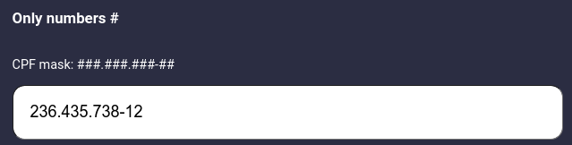

# UTILS Collect

Welcome to the list of breaker features that saved my life and still save many times.
> Remembering, the functions shown here are usually of FrontEnd utility, but nothing prevents them from being used in BackEnd if appropriate.

## masker
- The masker.js is a function that as its name says, it generates a mask for the string normally used in the application's inputs to format the text while the user types, it can also be used when, for example, you receive a value from BackEnd a CPF for example but it is not formatted and you need to show the CPF to the user now what? Using masker.js is easy.
> Usage example in Reactjs 



```javascript
import React, { useState } from 'react';
import Masker from '../path/to/masker.js';

const App = () => {
  const [text, setText] = useState('');

  return (
    <input
      placeholder='Digite seu CPF'
      value={text}
      onChange={e => setText(Masker(e.target.value, ['###.###.###-##']))}
    />
  )
}
```

## RegExp Validations
- Email ```/[a-zA-z0-9]+@[a-zA-Z0-9]+\.[a-zA-Z]{3,}/```
> email@email.com
- CPF `/[0-9]{3}\.[0-9]{3}\.[0-9]{3}-[0-9]{2}/`
> 999.999.999-99
- Date `/^(0?[1-9]|[12][0-9]|3[01])\/(0?[1-9]|1[012])\/19[789][0-9]|20[01][0-9]/`
>  31/12/1970-2019
- Telephone `/\([0-9]{2}\)\s?[0-9]{4,5}-?[0-9]{4}/`
> (99) 99999-9999
- Altura `/[1-2],[1-9]{2}/`
> 1-2,99
- Peso `/[0-9]{2}|[0-9]{2}\.[0-9]|[0-9]{3}\.[0-9]/`
> 45 / 45.4 / 140.4